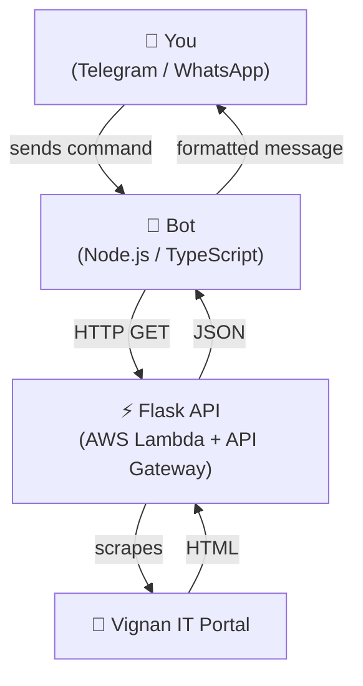

# Vignan IT Attendance Tracker

> Check your college attendance instantly via **Telegram** or **WhatsApp** — powered by a serverless Python API on AWS Lambda.

---

## How It Works




---

## Repo Structure

```
Attendance_tracker/
├── api/           Flask scraper — deployed to AWS Lambda via Zappa
├── telegram/      Telegram bot  — node-telegram-bot-api
└── whatsapp/      WhatsApp bot  — Baileys + DynamoDB
```

All TypeScript bots share a single root `package.json` / `tsconfig.json`.

---

## Prerequisites

| Requirement | Version |
|---|---|
| Node.js | 18+ |
| Python | 3.12 |
| AWS credentials | `~/.aws/credentials` or IAM role |

---

## Environment Variables

Copy `.env.example` to `.env` at the repo root and fill in all values.

| Variable | Used by | Description |
|---|---|---|
| `AWS_REGION` | whatsapp, api | AWS region for DynamoDB & Lambda (e.g. `ap-southeast-2`) |
| `AWS_PROFILE` | api | AWS CLI profile name |
| `ZAPPA_S3_BUCKET` | api | S3 bucket for Zappa deployments |
| `ZAPPA_ROLE_ARN` | api | IAM role ARN for the Lambda function |
| `API_BASE_URL` | telegram, whatsapp | Base URL of the deployed Flask API (no trailing slash) |
| `TELEGRAM_BOT_TOKEN` | telegram | Token from [@BotFather](https://t.me/BotFather) |
| `DYNAMODB_AUTH_TABLE` | whatsapp | DynamoDB table for Baileys session state |
| `DYNAMODB_USER_TABLE` | whatsapp | DynamoDB table for user shortform credentials |

---

## Setup

### 1 — API (Flask + Zappa → AWS Lambda)

```bash
cd api
python -m venv venv && source venv/bin/activate
pip install -r requirements.txt

# First deploy
zappa deploy dev

# Update existing deploy
zappa update dev
```

### 2 — Telegram Bot

```bash
# from repo root
npm install
npm run start:telegram
```

### 3 — WhatsApp Bot

```bash
# from repo root
npm install
npm run start:whatsapp
```

On first run a **QR code** is printed to the terminal — scan it with WhatsApp to link the session. Auth state is persisted automatically in DynamoDB.

---

## DynamoDB Tables

Create these tables before running the WhatsApp bot:

| Table (env var) | Partition key | Purpose |
|---|---|---|
| `DYNAMODB_AUTH_TABLE` | `id` · String | Baileys WhatsApp session |
| `DYNAMODB_USER_TABLE` | `phoneNumber` · String | User shortform credentials |

---

## WhatsApp Bot Commands

| Command | Description |
|---|---|
| `<rollNo> <password>` | Fetch attendance directly (one-off) |
| `set <id> <rollNo> <password>` | Save a shortform for quick reuse |
| `<id>` | Fetch attendance using a saved shortform |
| `skip <id> <hours>` | Simulate skipping N hours — shows new % |
| `shortforms` | List all saved shortforms |
| `delete <id>` | Remove a saved shortform |

## Telegram Bot Commands

| Command | Description |
|---|---|
| `/start` | Show usage instructions |
| `/get <rollNo> <password>` | Fetch attendance with an inline refresh button |

---

## API Endpoints

| Method | Path | Params | Description |
|---|---|---|---|
| GET | `/attendance` | `student_id`, `password` | Full attendance report |
| GET | `/compare` | `student_id`, `password` | Subject-wise comparison |
| GET | `/skip` | `student_id`, `password`, `hours` | Skip simulation |
